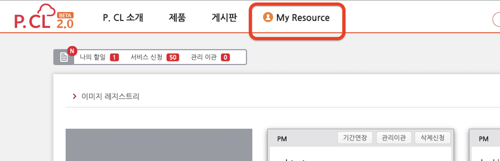
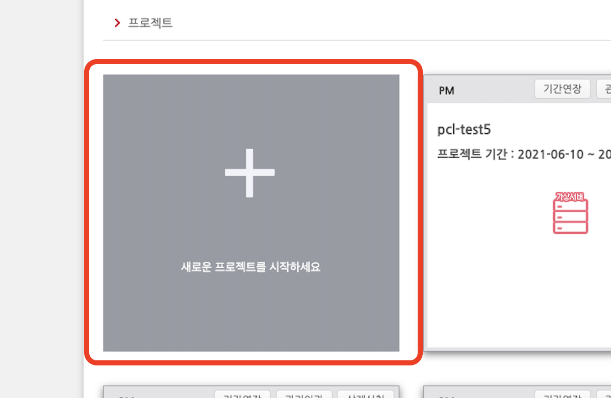
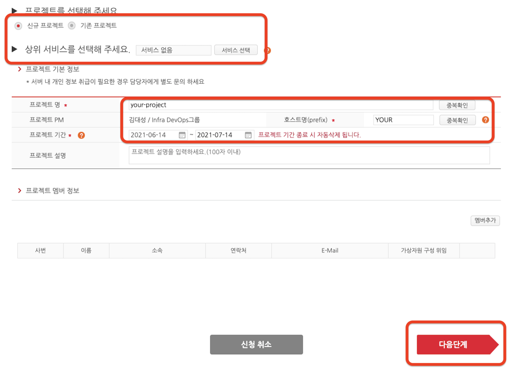
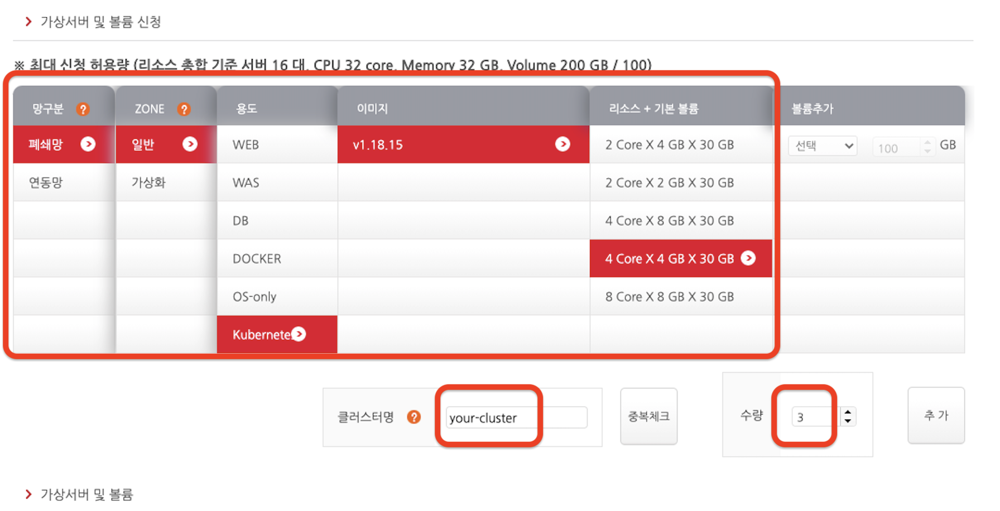
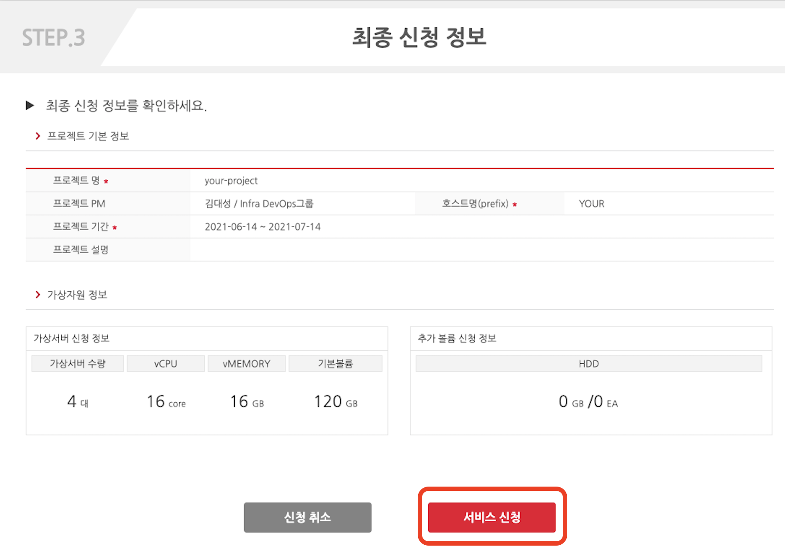
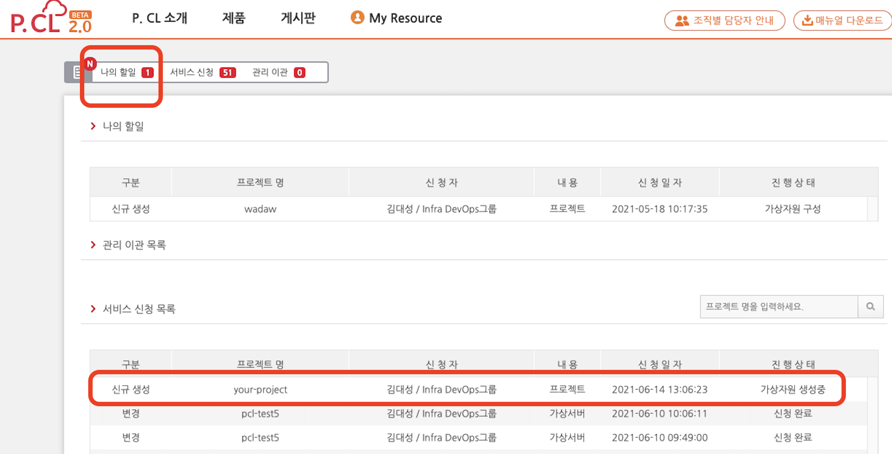
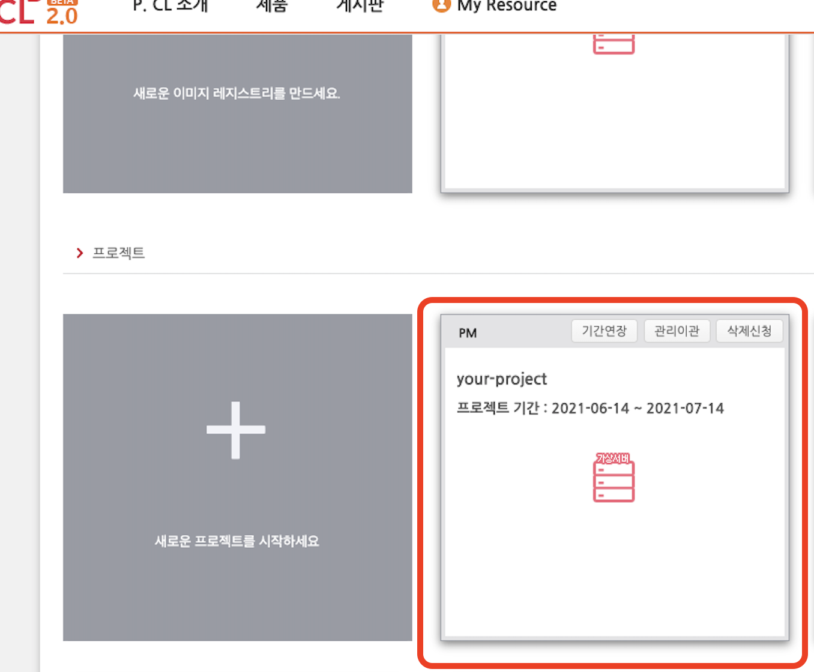
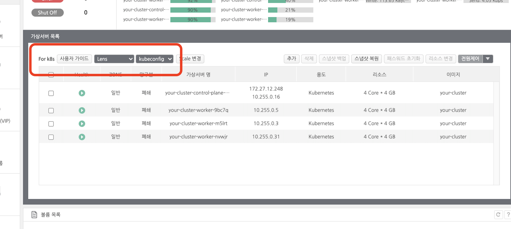

# 클러스터 생성 가이드

P.CL 포털을 통해 Kubernetes 클러스터를 생성할 수 있습니다.

1. P.CL 포털 상단 ``My Resource`` 클릭

1. 새로운 프로젝트 시작 클릭

1. 기본 정보 입력

  * ``신규 프로젝트`` 선택 및 ``상위 서비스 없음`` 선택
  * ``프로젝트 명`` 입력 후 ``중복확인``
  * ``호스트명`` 입력 후 ``중복확인`` : _Kubernetes 클러스터에 사용되지 않는 값이므로 임의 입력 가능합니다._
  * ``프로젝트 기간`` 입력 : _생성 완료 후 연장 가능합니다._
  * ``다음단계`` 클릭

1. Kubernetes 클러스터 정보 입력

  * ``망구분`` 선택 : _OA망 접속용은 Local PC에서 접근가능하기 때문에 "OA망 접속용" 장려합니다._
    * 폐쇄망 : ``OA망 접속용`` 으로 이름 변경 예정. OA망에서 접근하려면 선택
	  * 연동망 : ``MyDesk 접속용`` 으로 이름 변경 예정. MyDesk에서 접근하려면 선택
  * ``Zone`` 선택 : _Kubernetes 클러스터는 CPU 가상화 기능을 사용하지 않기 때문에 일반 Zone 선택 장려합니다._
    * 일반 : 생성된 가상머신의 vCPU에 가상화 명령어 미탑재
    * 가상화 : 생성된 가상머신의 vCPU에 가상화 명령어 탑재
  * ``용도`` 는 Kubernetes 선택
  * ``이미지``는 Kubernetes Version을 의미함. 문서 작성일 기준 v1.18.15 지원
  * ``리소스+기본 볼륨``은 최대 신청 허용량 한도 내에서 선택 가능
  * ``볼륨추가`` : Kubernetes 클러스터는 미지원
  * ``클러스터명`` 입력 후 ``중복체크``
  * ``수량``은 Kubernetes 클러스터 중 worker node의 개수를 의미함. 3을 입력했다면 control plane 1대, worker node 3대. 총 4대의 가상머신이 생성되어 클러스터 구성이 됨. 숫자 입력 후 ``추가`` 버튼 클릭
  * ``다음단계`` 클릭

용도 | 재택근무 사용 | 클러스터에서 outbound | OA망에서 접근 | 사내 서비스 연동 개발
OA망 접속용 | 불가 | 가능 | 가능 | 불가
MyDesk 접속용 | 가능 | 최초 3일간만 가능 (연장 신청 가능) | 불가 | 가능

1. 최종 신청 정보 확인 후 ``서비스 신청`` 클릭

1. P.CL 포털 상단 ``나의 할일``을 통해 가상 자원 생성 상태 확인 가능 : _약 10분 정도의 시간이 소요됩니다.__

1. 생성이 완료되면 ``My Resource``에 ``프로젝트``가 생성된 것 확인 가능

1. ``생성된 프로젝트`` 선택 후 ``가상서버 목록``에서 생성된 클러스터 확인 가능

  * ``사용자 가이드`` 링크로 가이드 제공
  * ``Lens`` 링크로 Kubernetes GUI 다운로드 제공
  * ``kubeconfig`` 링크로 생성된 Kubernetes에로의 접근에 필요한 kubeconfig 파일 다운로드 제공
